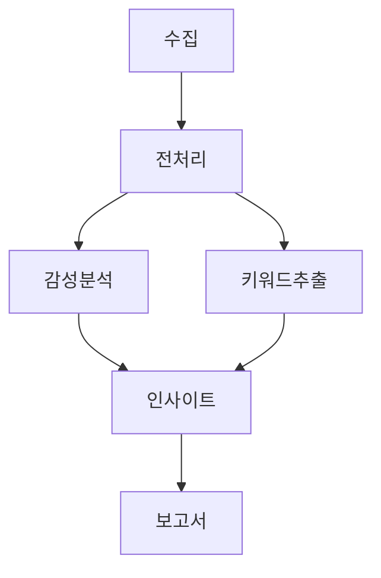

# 03. 4-Layer 에이전트 구조

## 개요

Dream Agent는 4개의 레이어로 구성된 파이프라인 구조입니다:

```
Cognitive → Planning → Execution → Response
```

각 레이어는 독립적인 역할을 수행하며, 이전 레이어의 출력을 입력으로 받습니다.

---

## Layer 1: COGNITIVE (의도 파악)

> 위치: `backend/app/dream_agent/cognitive/`

### 역할

- 사용자 입력의 **의도(Intent)** 파악
- **엔티티(Entity)** 추출 및 검증
- **대화 컨텍스트** 관리 (멀티턴 대화)

### 주요 컴포넌트

```
cognitive/
├── cognitive_node.py       # 메인 인지 노드
├── intent_classifier.py    # 의도 분류기
├── entity_extractor.py     # 엔티티 추출기
├── dialogue_manager.py     # 대화 관리자
├── intent_types.py         # 의도 타입 정의
├── language_detector.py    # 언어 감지
└── kbeauty_context.py      # K-Beauty 컨텍스트
```

### 의도 분류 (3-Depth)

```python
# Domain → Category → Subcategory

{
    "domain": "data_science",      # 최상위 도메인
    "category": "analysis",        # 카테고리
    "subcategory": "sentiment",    # 세부 분류
    "confidence": {
        "domain": 0.95,
        "category": 0.88,
        "subcategory": 0.82
    }
}
```

### 도메인 타입

| Domain | 설명 | 예시 |
|--------|------|------|
| `data_science` | 데이터 분석 | "리뷰 분석해줘", "트렌드 시각화" |
| `marketing` | 마케팅/콘텐츠 | "광고 카피 만들어줘", "캠페인 기획" |
| `operations` | 운영/리포팅 | "대시보드 만들어줘", "보고서 생성" |
| `analytics` | 일반 분석 | "경쟁사 분석", "시장 조사" |
| `general` | 일반 대화 | "안녕하세요", "도움말" |

### 엔티티 추출

```python
# 추출되는 엔티티 예시
{
    "brand": "라네즈",
    "product": "워터슬리핑마스크",
    "data_sources": ["reviews", "trends"],
    "time_range": "last_3_months",
    "language": "ko"
}
```

### 출력

```python
cognitive_result = {
    "intent": {
        "domain": "data_science",
        "category": "analysis",
        "subcategory": "sentiment"
    },
    "entities": {...},
    "confidence": {...},
    "language": "ko",
    "dialogue_context": {...}
}
```

---

## Layer 2: PLANNING (작업 계획)

> 위치: `backend/app/dream_agent/planning/`

### 역할

- **LLM 기반 계획** 생성
- **Todo 리스트** 자동 생성
- **의존성 관리** 및 위상 정렬
- **리소스 할당** 및 비용 추정

### 주요 컴포넌트

```
planning/
└── planning_node.py        # 메인 계획 노드

workflow_manager/
├── plan_manager.py         # 계획 관리
├── todo_manager.py         # Todo 생성/검증
├── resource_planner.py     # 리소스 할당
├── execution_graph_builder.py  # 실행 그래프
├── memory_manager.py       # 메모리 관리
└── hitl_manager.py         # HITL 관리
```

### Todo 자동 생성

```python
# 의도에서 Todo 자동 추론 (Auto-Inference)

Intent: "리뷰 감성 분석"
    ↓
Todo 1: 데이터 수집 (tool: collector)
Todo 2: 전처리 (tool: preprocessor, depends_on: [Todo 1])
Todo 3: 감성 분석 (tool: sentiment_analyzer, depends_on: [Todo 2])
Todo 4: 인사이트 생성 (tool: insight_generator, depends_on: [Todo 3])
```

### Todo 구조

```python
class TodoItem(BaseModel):
    id: str                   # UUID
    task: str                 # "리뷰 데이터 수집"
    task_type: str            # "collect", "analyze", "generate"
    layer: str                # "ml_execution", "biz_execution"
    status: str               # "pending", "in_progress", "completed", "failed"
    priority: int             # 0-10
    metadata: TodoMetadata    # 실행, 의존성, 진행상황 정보
```

### TodoMetadata

```python
class TodoMetadata(BaseModel):
    execution: ExecutionConfig    # tool, tool_params, timeout
    dependency: DependencyConfig  # depends_on, blocks
    data: DataConfig              # input_data, output_path
    progress: ProgressConfig      # progress_percentage, started_at
    approval: ApprovalConfig      # requires_approval, approved_by
```

### 의존성 관리

```python
# 의존성 해결 (Topological Sort)

todos = [
    {id: "t1", task: "수집", depends_on: []},
    {id: "t2", task: "전처리", depends_on: ["t1"]},
    {id: "t3", task: "분석", depends_on: ["t2"]},
    {id: "t4", task: "보고서", depends_on: ["t3"]}
]

# 정렬 후 실행 순서: t1 → t2 → t3 → t4
```

### 실행 그래프 (Mermaid)



### 출력

```python
planning_result = {
    "plan": {
        "description": "K-Beauty 리뷰 감성 분석",
        "total_steps": 4,
        "complexity": "medium"
    },
    "todos": [TodoItem, ...],
    "execution_graph": {...},
    "cost_estimate": {
        "total_cost": 0.02,
        "duration_estimate": "30s"
    }
}
```

---

## Layer 3: EXECUTION (실행)

> 위치: `backend/app/dream_agent/execution/`

### 역할

- **Todo 라우팅**: Tool → Executor 매핑
- **의존성 확인**: Ready Todo만 실행
- **실행 루프**: 모든 Todo 완료까지 반복
- **WebSocket 업데이트**: 실시간 진행상황 전송

### 주요 컴포넌트

```
execution/
├── execution_node.py       # 메인 실행 노드
├── supervisor.py           # ExecutionSupervisor
├── data_executor.py        # 데이터 수집/처리
├── insight_executor.py     # 인사이트 생성
├── content_executor.py     # 콘텐츠 생성
├── ops_executor.py         # 운영 작업
├── core/
│   ├── base_executor.py    # BaseExecutor
│   ├── registry.py         # ExecutorRegistry
│   └── cache.py            # ExecutionCache
└── domain/                 # 도메인별 에이전트
```

### Executor 매핑

```python
TOOL_TO_EXECUTOR = {
    # DataExecutor
    "collector": "data_executor",
    "preprocessor": "data_executor",
    "google_trends": "data_executor",

    # InsightExecutor
    "sentiment": "insight_executor",
    "keyword": "insight_executor",
    "keyword_extractor": "insight_executor",      # Alias
    "hashtag": "insight_executor",
    "problem": "insight_executor",
    "competitor": "insight_executor",
    "insight": "insight_executor",
    "insight_generator": "insight_executor",      # Alias
    "insight_with_trends": "insight_executor",    # K-Beauty RAG
    "absa_analyzer": "insight_executor",

    # ContentExecutor
    "report": "content_executor",
    "report_agent": "content_executor",           # Alias
    "video": "content_executor",
    "video_agent": "content_executor",            # Alias
    "ad_creative": "content_executor",
    "storyboard_agent": "content_executor",

    # OpsExecutor
    "sales": "ops_executor",
    "inventory": "ops_executor",
    "dashboard": "ops_executor",
}
```

### 실행 흐름

```python
# execution_node.py

async def execution_node(state: AgentState) -> AgentState:
    # 1. Ready Todo 찾기 (pending + 의존성 해결됨)
    ready_todo = get_first_ready_todo(state["todos"])

    if not ready_todo:
        return state  # 모든 Todo 완료

    # 2. Todo → Executor 라우팅
    supervisor = get_execution_supervisor()
    executor = supervisor.get_executor_for_tool(ready_todo.tool)

    # 3. 실행
    result = await executor.execute(ready_todo, context)

    # 4. 상태 업데이트
    update_todo_status(ready_todo, "completed", result)

    # 5. WebSocket 알림
    await notify_progress(session_id, ready_todo, result)

    return state
```

### 실행 결과

```python
class ExecutionResult(BaseModel):
    success: bool
    data: Dict[str, Any]    # 실행 결과 데이터
    error: Optional[str]
    metadata: Dict          # cached, execution_time 등
    todo_id: Optional[str]
```

### DataExecutor 도구

| Tool | 설명 |
|------|------|
| `collector` | 멀티 플랫폼 리뷰 수집 (Amazon, OliveYoung, YouTube) |
| `preprocessor` | 텍스트 전처리 (언어 감지, 정규화, 토큰화) |
| `google_trends` | Google Trends 분석 |

### InsightExecutor 도구

| Tool | 설명 |
|------|------|
| `sentiment_analyzer` | 감성 분석 (ABSA) |
| `keyword_extractor` | 키워드 추출 (TF-IDF) |
| `hashtag_analyzer` | 해시태그 분석 |
| `problem_classifier` | 문제점 분류 |
| `competitor_analyzer` | 경쟁사 분석 (SWOT) |
| `insight_generator` | LLM 기반 인사이트 생성 |
| `insight_with_trends` | K-Beauty RAG 인사이트 |

### ContentExecutor 도구

| Tool | 설명 |
|------|------|
| `report_agent` | PDF/마크다운 보고서 생성 |
| `video_agent` | AI 비디오 생성 |
| `ad_creative_agent` | 광고 카피 생성 |
| `storyboard_agent` | 스토리보드 생성 |

### 출력

```python
execution_result = {
    "ml_result": {
        "sentiment": {...},
        "keywords": [...],
        "insights": [...]
    },
    "biz_result": {
        "report_path": "data/reports/...",
        "dashboard_url": "..."
    }
}
```

---

## Layer 4: RESPONSE (응답 생성)

> 위치: `backend/app/dream_agent/response/`

### 역할

- **결과 집계**: ML + Biz 결과 통합
- **요약 생성**: 컨텍스트 최적화 (10KB 제한)
- **마크다운 포맷팅**: 사용자 친화적 출력
- **보고서 저장**: JSON 파일로 저장

### 주요 컴포넌트

```
response/
└── response_node.py        # 메인 응답 노드
```

### 응답 템플릿

| 템플릿 | 조건 | 설명 |
|--------|------|------|
| `with_ml_and_biz` | ML + Biz 결과 있음 | 종합 분석 |
| `with_ml_result` | ML 결과만 있음 | 분석 결과 |
| `with_biz_result` | Biz 결과만 있음 | 비즈니스 결과 |
| `base` | 결과 없음 | 기본 응답 |

### K-Beauty 트렌드 리포트

```python
# 특별 처리: K-Beauty 트렌드 분석
if "insight_with_trends" in tools_used:
    report = generate_kbeauty_trend_report(ml_result)
    save_trend_report(report)  # data/result_trend/
```

### 출력

```python
response = """
## K-Beauty 글로벌 트렌드 분석 리포트

### 1. 감성 분석 결과
- 긍정 리뷰: 68%
- 부정 리뷰: 12%
- 중립 리뷰: 20%

### 2. 주요 키워드
- 보습력 (45회)
- 촉촉함 (32회)
- 가성비 (28회)

### 3. 인사이트
1. 라네즈 워터슬리핑마스크의 보습력에 대한 긍정적 평가가 우세합니다.
2. 가성비에 대한 언급이 증가하고 있어 합리적 가격 정책이 중요합니다.
...
"""
```

---

## 상태 흐름 (AgentState)

```python
class AgentState(TypedDict):
    # 입력
    user_input: str
    session_id: str

    # Layer 1 출력
    cognitive_result: Dict       # intent, entities

    # Layer 2 출력
    plan: Optional[Plan]
    todos: List[TodoItem]

    # Layer 3 출력
    ml_result: Dict              # 분석 결과
    biz_result: Dict             # 비즈니스 결과

    # Layer 4 출력
    response: str                # 최종 응답
    final_answer: str

    # 메타데이터
    current_context: Dict
    language: str
```

---

## 레이어 간 데이터 전달

```
┌─────────────────────────────────────────────────────────────────┐
│  COGNITIVE                                                       │
│  Input:  user_input="라네즈 리뷰 분석"                            │
│  Output: cognitive_result={intent, entities, language}           │
└─────────────────────────────────────────────────────────────────┘
                              │
                              ▼
┌─────────────────────────────────────────────────────────────────┐
│  PLANNING                                                        │
│  Input:  cognitive_result                                        │
│  Output: plan, todos (with dependencies)                         │
└─────────────────────────────────────────────────────────────────┘
                              │
                              ▼
┌─────────────────────────────────────────────────────────────────┐
│  EXECUTION (Loop)                                                │
│  Input:  todos, context                                          │
│  Output: ml_result, biz_result (실시간 WebSocket 업데이트)        │
└─────────────────────────────────────────────────────────────────┘
                              │
                              ▼
┌─────────────────────────────────────────────────────────────────┐
│  RESPONSE                                                        │
│  Input:  ml_result, biz_result                                   │
│  Output: response (마크다운), saved report                        │
└─────────────────────────────────────────────────────────────────┘
```
