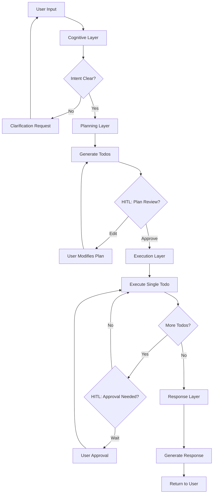

# Enterprise Agent System Architecture
**Version**: 2.0 | **Date**: 2026-02-05 | **Status**: Draft

## 1. Overview

기업용 AI 에이전트 시스템으로, 4-Layer 아키텍처 기반의 Human-in-the-Loop(HITL) 워크플로우를 제공합니다.

```
┌─────────────────────────────────────────────────────────────────┐
│                        Client Layer                              │
│  ┌─────────────┐  ┌─────────────┐  ┌─────────────────────────┐  │
│  │   Web UI    │  │  REST API   │  │      WebSocket          │  │
│  └─────────────┘  └─────────────┘  └─────────────────────────┘  │
└─────────────────────────────────────────────────────────────────┘
                              │
                              ▼
┌─────────────────────────────────────────────────────────────────┐
│                     API Gateway (FastAPI)                        │
│  ┌─────────────┐  ┌─────────────┐  ┌─────────────────────────┐  │
│  │   Routes    │  │ Middleware  │  │      Schemas            │  │
│  └─────────────┘  └─────────────┘  └─────────────────────────┘  │
└─────────────────────────────────────────────────────────────────┘
                              │
                              ▼
┌─────────────────────────────────────────────────────────────────┐
│                 4-Layer Agent Architecture                       │
│  ┌─────────────────────────────────────────────────────────────┐│
│  │  1. COGNITIVE LAYER                                         ││
│  │     Intent Classification → Entity Extraction               ││
│  │     → Dialogue Management → Context Analysis                ││
│  └─────────────────────────────────────────────────────────────┘│
│                              ↓                                   │
│  ┌─────────────────────────────────────────────────────────────┐│
│  │  2. PLANNING LAYER                                          ││
│  │     Todo Generation → Dependency Calculation                ││
│  │     → Resource Allocation → Execution Graph                 ││
│  └─────────────────────────────────────────────────────────────┘│
│                              ↓                                   │
│  ┌─────────────────────────────────────────────────────────────┐│
│  │  3. EXECUTION LAYER                                         ││
│  │     Supervisor → Domain Executors (Data/Insight/Content/Ops)││
│  │     → Single Todo per Cycle → Real-time Streaming           ││
│  └─────────────────────────────────────────────────────────────┘│
│                              ↓                                   │
│  ┌─────────────────────────────────────────────────────────────┐│
│  │  4. RESPONSE LAYER                                          ││
│  │     Result Aggregation → Smart Summarization                ││
│  │     → Natural Language Generation                           ││
│  └─────────────────────────────────────────────────────────────┘│
└─────────────────────────────────────────────────────────────────┘
                              │
                              ▼
┌─────────────────────────────────────────────────────────────────┐
│                     Infrastructure Layer                         │
│  ┌─────────────┐  ┌─────────────┐  ┌─────────────────────────┐  │
│  │ PostgreSQL  │  │   Redis     │  │    Vector DB            │  │
│  │ Checkpoint  │  │   Cache     │  │    (FAISS/Chroma)       │  │
│  └─────────────┘  └─────────────┘  └─────────────────────────┘  │
└─────────────────────────────────────────────────────────────────┘
```

## 2. Core Design Principles

### 2.1 Single Todo Execution Per Cycle
- 각 실행 사이클에서 하나의 Todo만 처리
- Real-time WebSocket을 통한 진행상황 스트리밍
- 사용자 개입 지점 명확화

### 2.2 Human-in-the-Loop (HITL)
- Plan 수정: 사용자가 Todo 추가/삭제/순서변경 가능
- Approval Gate: 중요 단계에서 사용자 승인 대기
- Input Request: 실행 중 필요 정보 요청
- Pause/Resume: 언제든 일시정지 및 재개

### 2.3 Declarative Tool Definition
- YAML 기반 도구 정의
- Hot-reload 지원
- Dynamic Discovery & Registration

### 2.4 State Persistence
- LangGraph Checkpoint (PostgreSQL)
- 세션 복구 및 재개 가능
- 버전 관리된 Plan History

## 3. Component Architecture

### 3.1 Directory Structure
```
backend/
├── api/                      # FastAPI Application
│   ├── main.py              # App entry point
│   ├── routes/              # API endpoints
│   ├── schemas/             # Request/Response models
│   └── middleware/          # CORS, Auth, etc.
│
├── app/
│   ├── core/                # Configuration
│   │   ├── config.py        # Environment settings
│   │   └── logging.py       # Logging setup
│   │
│   └── dream_agent/         # Core Agent System
│       ├── cognitive/       # Layer 1: Intent Analysis
│       ├── planning/        # Layer 2: Todo Generation
│       ├── execution/       # Layer 3: Task Execution
│       ├── response/        # Layer 4: Response Synthesis
│       ├── orchestrator/    # LangGraph Orchestration
│       ├── models/          # Data Models (Pydantic)
│       ├── states/          # State Management
│       ├── tools/           # Tool Registry
│       ├── workflow_manager/# HITL Managers
│       ├── llm_manager/     # LLM Integration
│       └── callbacks/       # Event Callbacks
│
└── scripts/                 # Utility Scripts
```

### 3.2 Layer Responsibilities

| Layer | Input | Process | Output |
|-------|-------|---------|--------|
| Cognitive | user_input | Intent/Entity/Context | intent dict |
| Planning | intent | Todo generation, DAG | todos, plan_obj |
| Execution | todos | Tool execution | results |
| Response | results | Summarize & Generate | response text |

## 4. Data Flow



## 5. Integration Points

### 5.1 External Services
- **LLM Providers**: OpenAI, Anthropic
- **Vector DB**: FAISS, ChromaDB
- **Media Generation**: RunPod (FLUX, WAN22)
- **Data Sources**: External APIs, Mock Data

### 5.2 Internal Integration
- **Checkpoint DB**: PostgreSQL for state persistence
- **Cache**: Redis for execution cache
- **WebSocket**: Real-time event streaming

## 6. Scalability Considerations

### 6.1 Horizontal Scaling
- Stateless API servers behind load balancer
- Shared checkpoint storage (PostgreSQL)
- Redis cluster for caching

### 6.2 Performance Optimization
- Execution cache to avoid re-runs
- Parallel todo execution (within dependency constraints)
- Lazy loading of tools

## 7. Security Architecture

### 7.1 Authentication (To Be Implemented)
- JWT-based authentication
- API Key management
- Role-based access control

### 7.2 Data Protection
- Sensitive data encryption at rest
- TLS for data in transit
- Audit logging

## 8. Monitoring & Observability

### 8.1 Logging
- Structured logging with Loguru
- Request/Response tracing
- Error tracking

### 8.2 Metrics (To Be Implemented)
- Execution time per layer
- Todo completion rates
- LLM token usage

---

## Related Documents
- [DATA_MODELS_260205.md](DATA_MODELS_260205.md) - Data model definitions
- [DB_SCHEMA_260205.md](DB_SCHEMA_260205.md) - Database schema
- [LAYER_SPEC_260205.md](LAYER_SPEC_260205.md) - 4-Layer specifications
- [TODO_SYSTEM_260205.md](TODO_SYSTEM_260205.md) - Todo & HITL system
- [API_SPEC_260205.md](API_SPEC_260205.md) - API specifications
- [TOOL_REGISTRY_260205.md](TOOL_REGISTRY_260205.md) - Tool system
